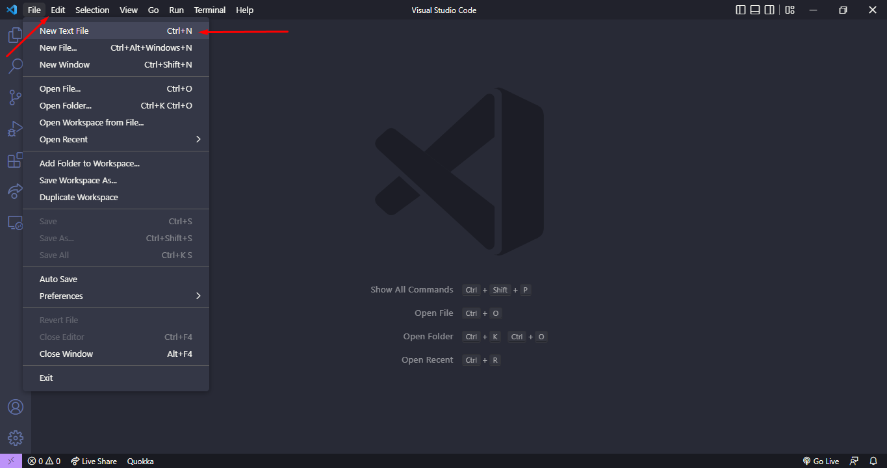
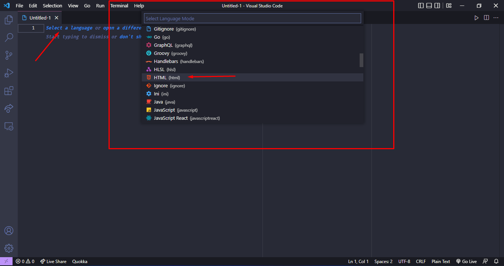
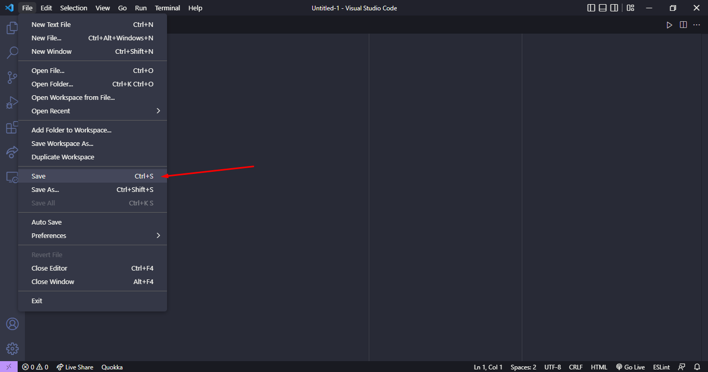
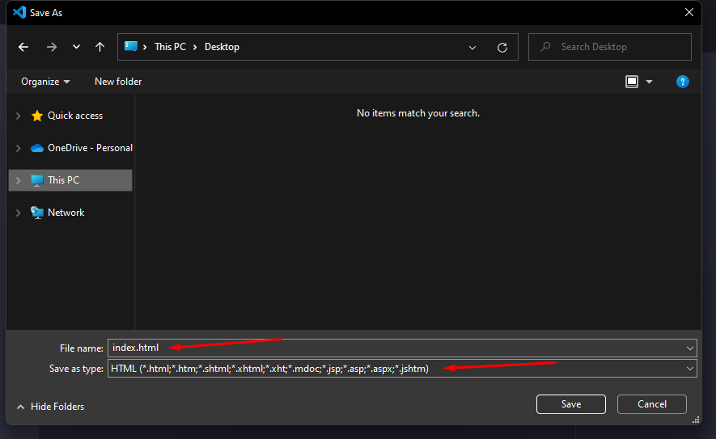
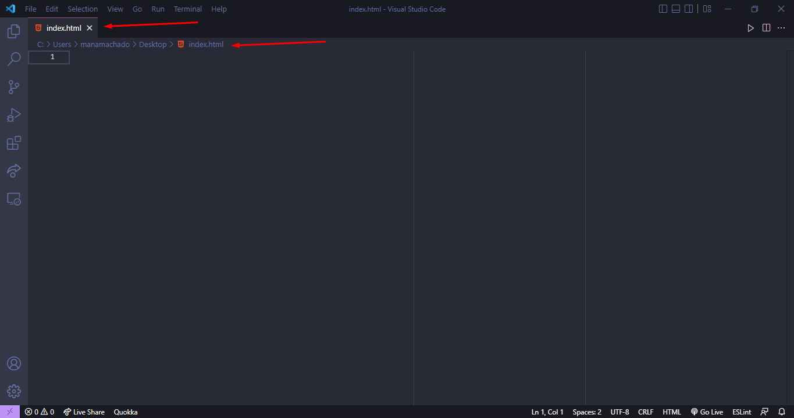

# Aula 1

Nessa aula, aprendemos:

* [O que é HTML?](1-o-que-e-html.md)
* [Como funciona o HTML?](2-como-funciona-o-html.md)
* [O que são tags?](3-o-que-sao-tags.md)
* [Principais tags do HTML](4-principais-tags-do-html.md)
* [Comentários no HTML](5-comentarios-no-html.md)
* [Exemplo de um arquivo HTML](6-exemplos-html.md)

## E também aprendemos:
## Como criar um arquivo HTML no VS Code

##### Com o VS Code aberto, clique em `File` e na sequência em `New Text File`

##### Depois, clique em `Select a language` e escolha a opção `HTML` na caixa de seleção que irá se abrir.

##### Depois, clique em `File` novamente e salve o arquivo na opção `Save`ou use `CTRL + S` no seu teclado.

##### Escolha o local onde você irá salvar o seu arquivo HTML, lembrando de prestar atenção na extensão e no tipo do arquivo. Na sequencia, salve o arquivo.

##### Com o arquivo salvo, veja se o mesmo está na pasta escolhida e se está com a extensão correta.

##### Depois é só codar :)
