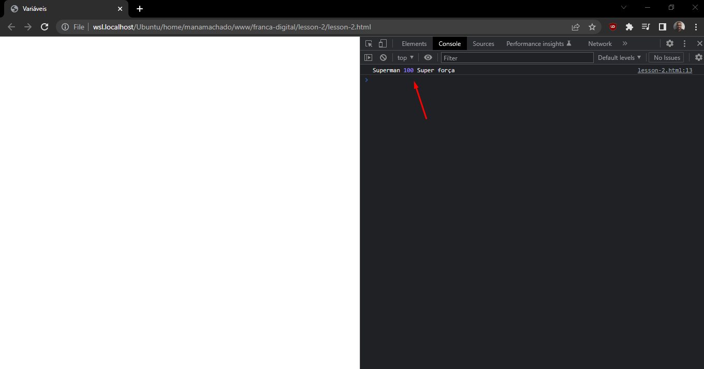
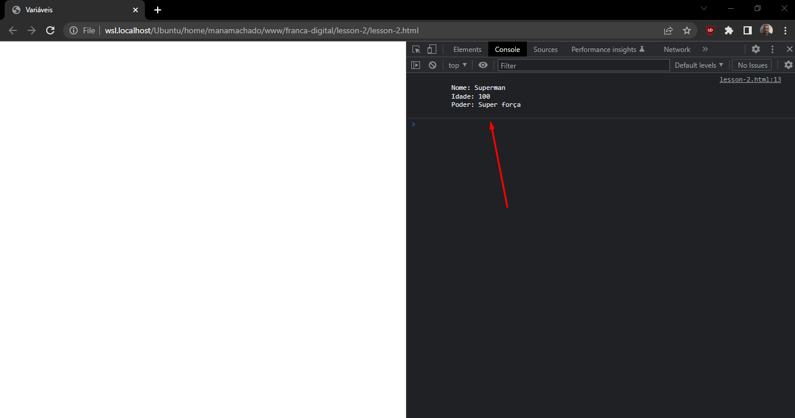

# Variáveis

Variáveis são espaços que criamos na memória do computador para guardarmos valores.

Trazendo para o mundo real, variáveis são como as gavetas de um armário, onde podemos colocar itens ali dentro e pegar quando desejarmos.

Para criar uma variável que pode ser re-assinada (ter o seu valor original substituído), podemos fazer de 2 formas:

Usando `let` (forma mais moderna):

```js
let nomeDaVariavel = "Valor qualquer"
```

Usando `var` (foi depreciado):

```js
var nomeDaVariavel = "Valor qualquer"
```

Para criar uma variável que não terá alteração no seu valor, usamos:


```js
const minhaConstante = "Valor da constante"
```

Para os nomes de suas variáveis e constantes, use palavras que façam sentido e que sejam fáceis de serem identificadas.

Evite palavras reservadas do Javascript, aqui temos uma relação de quais são essas palavras: https://www.w3schools.com/js/js_reserved.asp

Para exibirmos as nossas variáveis no console, podemos considerar o exemplo:

```html
<!DOCTYPE html>
<html lang="en">
  <head>
    <meta charset="UTF-8">
    <title>Variáveis</title>
</head>
<body>
  <script>
    let nome = "Superman"
    let idade = 100
    let poder = "Super força"

    console.log(nome, idade, poder)
  </script>
</body>
</html>
```

E o resultado no console será:



Podemos melhorar a forma como as nossas variáveis estão sendo exibidas no console através das `Template Strings`.

Template Strings são strings (textos) que permitem embutirmos código Javascript. Basicamente é uma nova forma de criar strings e tornar o seu código um pouco mais legível.

Considerando o código:

```html
<!DOCTYPE html>
<html lang="en">
  <head>
    <meta charset="UTF-8">
    <title>Variáveis</title>
</head>
<body>
  <script>
    let nome = "Superman"
    let idade = 100
    let poder = "Super força"

    console.log(
      `
        Nome: ${nome}
        Idade: ${idade}
        Poder: ${poder}
      `
    )
  </script>
</body>
</html>
```

O resultado será:

