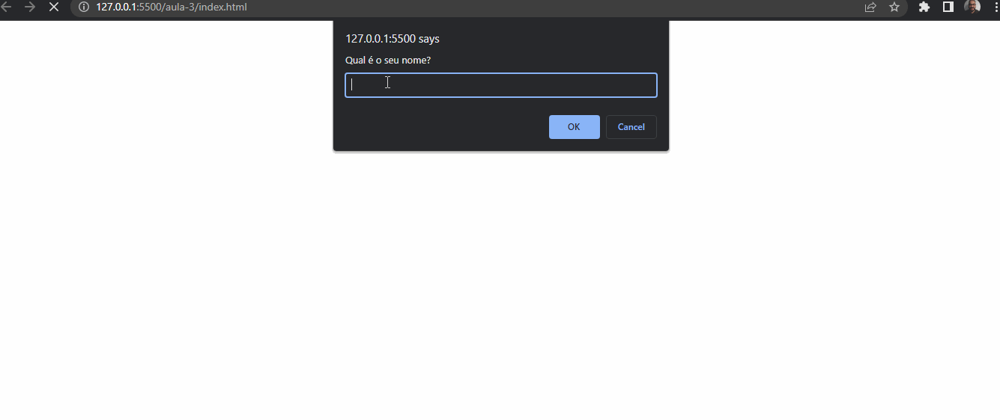

# Aula 3

Nessa aula, aprendemos:

* [Tipos de Dados](1-tipos-de-dados.md)
* [Trabalhando com Strings](2-trabalhando-com-strings.md)
* [Trabalhando com Numbers](3-trabalhando-com-numbers.md)
* [Quiz](4-quiz.md)

## E também aprendemos:

## typeof

O Javascript possui um operador que nos retorna o tipo da variável em questão.

Considerando a variável:

```js
const nome = "João"
```

Executando o console.log na mesma passando o `typeof`

```js
console.log(typeof nome)
```

No console é mostrado:


## alert

Aprendemos também que no Javascript existe a função `alert` que é responsável por exibir informações na tela.

Considerando o código abaixo:

```js
alert('Olá mundo! Estou aprendendo Javascript')
```

O navegador exibe:


Você pode usá-lo da mesma forma que um `console.log()`, adicionando variáveis e fazendo operações

## prompt

Similar ao `alert`, existe a função `prompt`. A diferença entre eles é que o `prompt`, vai exibir junto à mensagem, uma caixa de texto para a coleta de informações.

Considerando o código abaixo:

```js
const nome = prompt('Qual é o seu nome?')
alert(`O seu nome é ${nome}`)
```

O navegador exibe:


