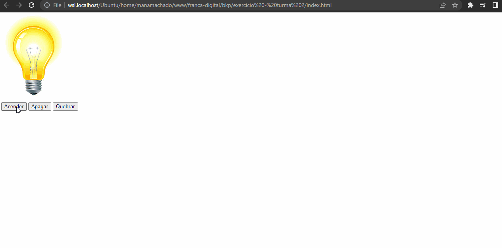

# Exercício resolvido

Nesse exercício, vamos usar o que aprendemos até aqui para acender, apagar e quebrar uma lâmpada:

Vamos começar criando o arquivo HTML, em uma pasta de sua preferência, crie o arquivo `acender-apagar-quebrar-lampada.html`

Dentro desse arquivo, vamos adicionar a estrutura básica do HTML:

```html
<!DOCTYPE html>
<html lang="pt-br">
<head>
  <meta charset="UTF-8">
  <meta http-equiv="X-UA-Compatible" content="IE=edge">
  <meta name="viewport" content="width=device-width, initial-scale=1.0">
  <title>Apagar, acender e quebrar a lâmpada</title>
</head>
<body>

</body>
</html>
```

Uma vez que definimos a nossa estrutura básica, vamos adicionar os elementos principais da nossa aplicação, são eles:

1. Uma imagem da lâmpada que iremos acender, apagar e quebrar, o estado inicial da imagem vai ser com a lâmpada apagada
2. Um botão para acender
3. Um botão para apagar
4. Um botão para quebrar a lâmpada, que, uma vez clicado, a lampada vai se quebrar e não será possivel acender ou apagar a mesma, somente se o sistema for carregado

Diante disso, vamos ao código.

Dentro dos elementos `<body>` e `</body>` vamos adicionar:

```html

<button>Acender</button>
<button>Apagar</button>
<button>Quebrar</button>
```

Repare que no exemplo acima, na tag ``, usamos o atributo `src` para definir o caminho da imagem, ou seja, de onde vamos pegar a imagem...no nosso caso, estamos pegando da URL `https://i.stack.imgur.com/ybxlO.jpg`. Também usamos o atributo `id` para servir como identificador do nosso elemento, pois vamos precisar pegar essa informação posteriormente.

Nos elementos `<button>` apenas colocamos a informação em texto do que cada um deles vai fazer.

Dessa forma, o nosso código está assim até o momento:

```html
<!DOCTYPE html>
<html lang="pt-br">
<head>
  <meta charset="UTF-8">
  <meta http-equiv="X-UA-Compatible" content="IE=edge">
  <meta name="viewport" content="width=device-width, initial-scale=1.0">
  <title>Apagar, acender e quebrar a lâmpada</title>
</head>
<body>
  
  <br> <!-- tag de quebra de linha pra deixar tudo no esquema :) -->
  <button>Acender</button>
  <button>Apagar</button>
  <button>Quebrar</button>
</body>
</html>
```

Agora vamos começar a programar de verdade! rs.

Vamos criar as funções que farão toda a mágica acontecer, elas serão responsáveis por cada ação dos botões do nosso HTML.

Vamos criar 3 funções dentro da tag `<script>`, antes do fechamento da tag `</body>`.

Essas funções não vão receber nenhum parametro, elas simplesmente serão responsáveis por retornar a imagem no estado em que o botão está pedindo.

Então vamos lá, primeiramente precisamos identificar o elemento que iremos manipular, no nosso caso é a tag `` que tem como `id` a palavra `lampada`. Vamos pegar esse elemento através do `document.getElementById` e adicionar essa informação à uma constante.

```html
<script>
  const lampada = document.getElementById('lampada')

  function acenderLampada() {
    return lampada.setAttribute('src', 'https://i.stack.imgur.com/ybxlO.jpg')
  }

  function apagarLampada() {
    return lampada.setAttribute('src', 'https://i.stack.imgur.com/b983w.jpg')
  }

  function quebrarLampada() {
    return lampada.setAttribute('src', 'https://i.stack.imgur.com/MRjsF.jpg')
  }
</script>
```

O código acima, já resolve todas as funcionalidades principais na nossa aplicação, porém, ainda precisamos implementar a regra onde, se a lâmpada estiver quebrada, não será possível acender ou apagar a mesma.

Após a nossa `const lampada` vamos criar uma variável `lampadaQuebrada` e inicializar o valor dela com `false`.

Na função `quebrarLampada` vamos atribuir o valor `true` à nossa variável `lampadaQuebrada`.

Nas funções `acenderLampada` e `apagarLampada` vamos adicionar uma validação com `if` para saber se a lâmpada está quebrada, se estiver, iremos exibir um `alert` informando que não é possivel apagar ou acender uma lâmpada quebrada.

Ficando dessa forma:

```html
<script>
  const lampada = document.getElementById('lampada')
  let lampadaQuebrada = false

  function acenderLampada() {
    if (lampadaQuebrada === true) {
      return alert('Não é possível acender uma lâmpada quebrada')
    }

    return lampada.setAttribute('src', 'https://i.stack.imgur.com/ybxlO.jpg')
  }

  function apagarLampada() {
    if (lampadaQuebrada === true) {
      return alert('Não é possível apagar uma lâmpada quebrada')
    }

    return lampada.setAttribute('src', 'https://i.stack.imgur.com/b983w.jpg')
  }

  function quebrarLampada() {
    lampadaQuebrada = true

    return lampada.setAttribute('src', 'https://i.stack.imgur.com/MRjsF.jpg')
  }
</script>
```

Agora, precisamos colocar a invocação das funções em cada botão que fizemos anteriormente, para isso, usaremos o atributo `onClick` do `<button>`.

```html
<button onclick="acenderLampada()">Acender</button>
<button onclick="apagarLampada()">Apagar</button>
<button onclick="quebrarLampada()">Quebrar</button>
```

E o nosso código completo vai ficar:

```html
<!DOCTYPE html>
<html lang="pt-br">
<head>
  <meta charset="UTF-8">
  <meta http-equiv="X-UA-Compatible" content="IE=edge">
  <meta name="viewport" content="width=device-width, initial-scale=1.0">
  <title>Apagar, acender e quebrar a lâmpada</title>
</head>
<body>
  
  <br>
  <button onclick="acenderLampada()">Acender</button>
  <button onclick="apagarLampada()">Apagar</button>
  <button onclick="quebrarLampada()">Quebrar</button>

  <script>
    const lampada = document.getElementById('lampadinha')
    let lampadaQuebrada = false
    
    function acenderLampada() {
      if (lampadaQuebrada === true) {
        return alert('Não é possível acender uma lâmpada quebrada')
      }

      return lampada.setAttribute('src', 'https://i.stack.imgur.com/ybxlO.jpg')
    }

    function apagarLampada() {
      if (lampadaQuebrada === true) {
        return alert('Não é possível apagar uma lâmpada quebrada')
      }

      return lampada.setAttribute('src', 'https://i.stack.imgur.com/b983w.jpg')
    }

    function quebrarLampada() {
      lampadaQuebrada = true

      return lampada.setAttribute('src', 'https://i.stack.imgur.com/MRjsF.jpg')
    }
  </script>
</body>
</html>
```

E ele funcionando vai ficar assim :)



