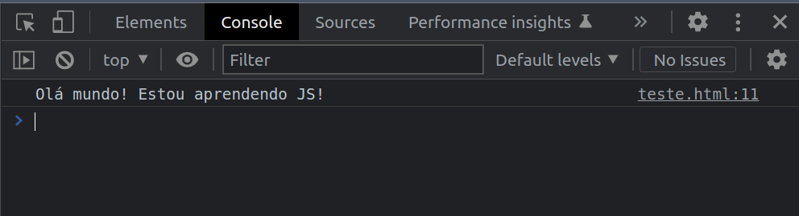

# console.log

O `console.log()` é uma maneira de exibirmos valores no console do navegador ou da linha de comando.

Para acessar o console, basta apertar a tecla `F12` e escolher a aba `Console`.

Para exibir uma mensagem qualquer no console, podemos considerar o exemplo:

```html
<!DOCTYPE html>
<html lang="en">
  <head>
    <meta charset="UTF-8">
    <title>Olá mundo no console</title>
</head>
<body>
  <script>
    console.log("Olá mundo! Estou aprendendo JS!");
  </script>
</body>
</html>
```

E o nosso resultado será:

