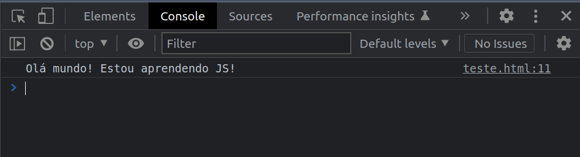

# Introdução ao Javascript
## Auto complete HTML

O VS Code tem uma tecla de atalho muito interessante que nos poupa o trabalho de escrever toda a estrutura do HTML.

Para acessar essa funcionalidade, basta criar um arquivo com a extensão `.html` em qualquer local de sua preferência, escrever `html:5` nesse arquivo e usar a tecla `TAB`, com isso, o VS Code vai gerar uma estrutura similar a essa:

```html
<!DOCTYPE html>
<html lang="en">
<head>
  <meta charset="UTF-8">
  <meta http-equiv="X-UA-Compatible" content="IE=edge">
  <meta name="viewport" content="width=device-width, initial-scale=1.0">
  <title>Document</title>
</head>
<body>

</body>
</html>
```

## console.log

O `console.log()` é uma maneira de exibirmos valores no console do navegador.

Para acessar o console, basta apertar a tecla `F12` e escolher a aba `Console`.


Para exibir uma mensagem qualquer no console, podemos considerar o exemplo:


```html
<!DOCTYPE html>
<html lang="en">
  <head>
    <meta charset="UTF-8">
    <title>Olá mundo no console</title>
</head>
<body>
  <script>
    console.log("Olá mundo! Estou aprendendo JS!");
  </script>
</body>
</html>
```

E o nosso resultado será:



## Variáveis

Trazendo para o mundo real, variáveis são como as gavetas de um armário, onde podemos colocar valores ali dentro e acessar quando desejarmos.

Para criar uma variável que pode ser re-assinada (ter o seu valor original substituido), temos 2 formas de se fazer isso:

Usando `let` (forma mais moderna):

```js
let nomeDaVariavel = "Valor qualquer"
```

Usando `var` (foi depreciado):

```js
var nomeDaVariavel = "Valor qualquer"
```

Para criar uma variável que não terá alteração no seu valor, usamos:


```js
const minhaConstante = "Valor da constante"
```

Para os nomes de suas variáveis e constantes, use palavras que façam sentido e que sejam fáceis de serem identificadas.

Evite palavras reservadas do Javascript, aqui temos uma relação de quais são essas palavras: https://www.w3schools.com/js/js_reserved.asp

Para exibirmos as nossas variáveis no console, podemos considerar o exemplo:

```html
<!DOCTYPE html>
<html lang="en">
  <head>
    <meta charset="UTF-8">
    <title>Olá mundo no console</title>
</head>
<body>
  <script>
    let nome = "Superman"
    let idade = 100
    let poder = "Super força"

    console.log(nome)
    console.log(idade)
    console.log(poder)
  </script>
</body>
</html>
```

Se quisermos alterar a forma que o console está exibindo as informações das nossas variáveis

```html
<!DOCTYPE html>
<html lang="en">
  <head>
    <meta charset="UTF-8">
    <title>Olá mundo no console</title>
</head>
<body>
  <script>
    let nome = "Superman"
    let idade = 100
    let poder = "Super força"

    console.log(
      `
        Nome: ${nome}
        Idade: ${idade}
        Poder: ${poder}
      `
    )
  </script>
</body>
</html>
```