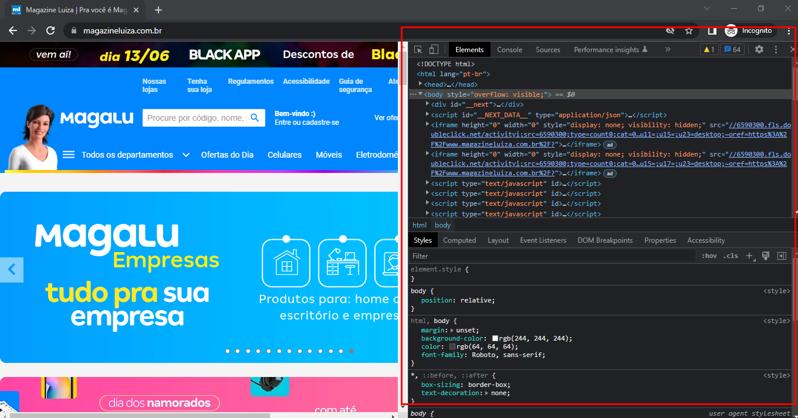

# Aula 2

Nessa aula, aprendemos:

* [Introdução ao Javascript](1-introducao-ao-js.md)
* [Tag script](2-tag-script.md)
* [console.log](3-console-log.md)
* [Variáveis](4-variaveis.md)
* [Comentários no Javascript](5-comentarios-no-js.md)

## E também aprendemos:
## Auto complete HTML

O VS Code tem uma tecla de atalho muito interessante que nos poupa o trabalho de escrever toda a estrutura do HTML.

Para acessar essa funcionalidade, basta criar um arquivo com a extensão `.html` em qualquer local de sua preferência, escrever `html:5` nesse arquivo e usar a tecla `TAB`, com isso, o VS Code vai gerar uma estrutura similar a essa:

```html
<!DOCTYPE html>
<html lang="en">
<head>
  <meta charset="UTF-8">
  <meta http-equiv="X-UA-Compatible" content="IE=edge">
  <meta name="viewport" content="width=device-width, initial-scale=1.0">
  <title>Document</title>
</head>
<body>

</body>
</html>
```

## Ferramentas do Desenvolvedor do Navegador

Para acessar as ferramentas do desenvolvedor, basta apertar a tecla `F12` e você verá algo similar com isso aqui:

